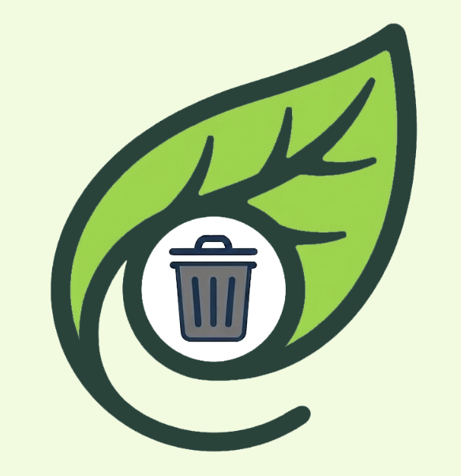
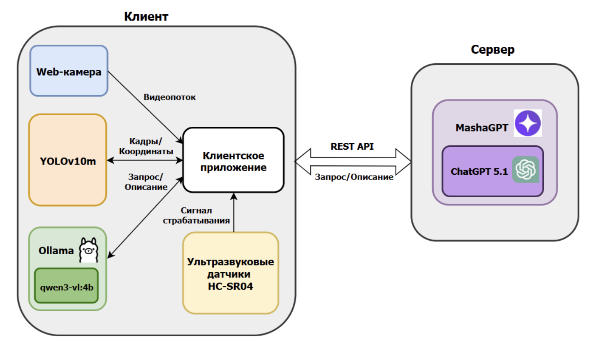
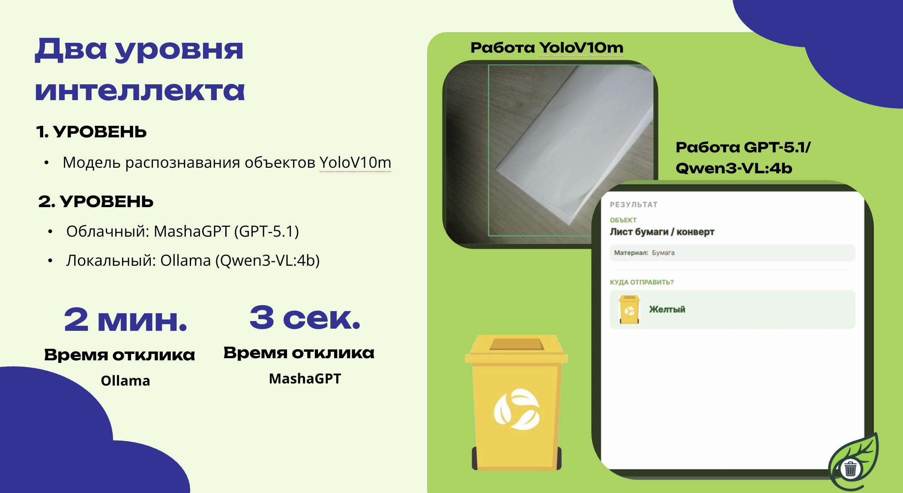
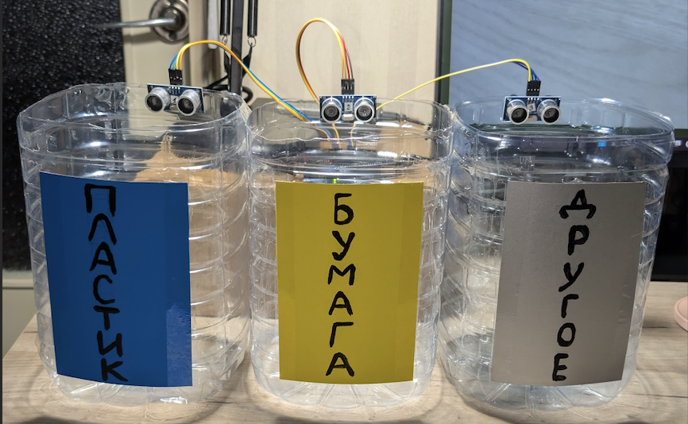
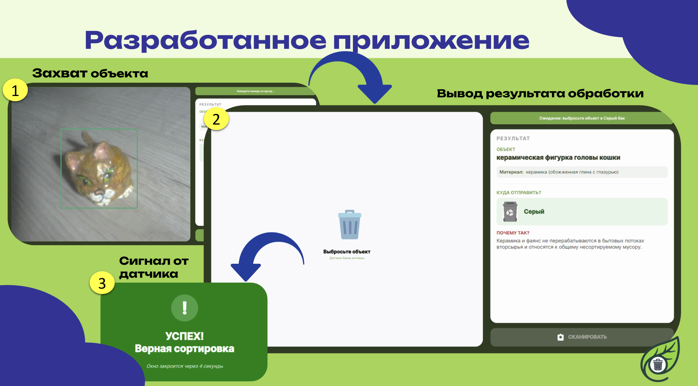
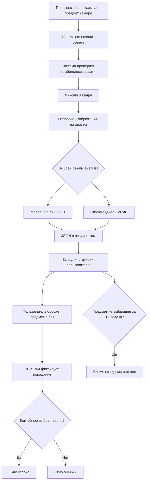
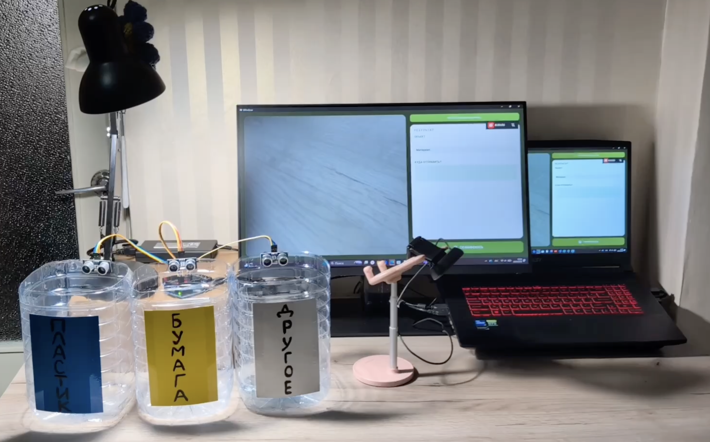

# ♻️ Интеллектуальная система распознавания бытовых отходов

<p align="center">
  
</p>

<p align="center">
  <b>Система визуального распознавания бытовых отходов и консультирования по их сортировке</b>
</p>

<p align="center">
  
  
  
  
  
  
  
</p>

---

##  О проекте

**Интеллектуальная система для визуального распознавания бытовых отходов** — это приложение, которое помогает пользователю правильно определить тип отхода и выбрать подходящий контейнер для сортировки.

Проект объединяет:

- компьютерное зрение;
- мультимодальные нейросетевые модели;
- физическую проверку попадания предмета в контейнер;
- удобный пользовательский интерфейс;
- взаимодействие с ультразвуковыми датчиками.

---

## Актуальность

Раздельный сбор отходов работает эффективно только тогда, когда пользователь понимает:

- из какого материала сделан предмет;
- можно ли его переработать;
- загрязнён ли он;
- в какой контейнер его нужно отправить;
- что делать, если предмет относится к смешанным или неперерабатываемым отходам.

Даже при наличии контейнеров для раздельного сбора люди часто ошибаются при сортировке. Это снижает качество переработки и увеличивает объём отходов, которые отправляются на полигоны.

Наш проект решает эту проблему через автоматизированную подсказку: пользователь показывает предмет камере, получает инструкцию и затем выбрасывает его в нужный бак. Система дополнительно проверяет действие с помощью датчиков.

---

## Авторы проекта

<p align="center">
  <b>Проект разработан командой из двух участников</b>
</p>

<table align="center">
  <tr>
    <td align="center" width="300">
      <br>
      <b>Анастасия Мозговая</b>
      <br>
      <sub>Разработчик проекта</sub>
      <br><br>
      <a href="https://github.com/anastasia-mozgovaya">
        
      </a>
    </td>
    <td align="center" width="300">
      <br>
      <b>Анна Скуратова</b>
      <br>
      <sub>Разработчик проекта</sub>
      <br><br>
      <a href="https://github.com/YRMemory">
        
      </a>
    </td>
  </tr>
</table>

---

## Основные возможности

### аспознавание объекта в кадре

Система использует модель машинного зрения **YOLOv10m**, которая в реальном времени отслеживает предмет в кадре и выделяет его рамкой.

### Фиксация стабильного кадра

Приложение анализирует положение рамки захвата. Если объект остаётся стабильным в течение заданного времени, система делает снимок и отправляет его на дальнейший анализ.

### Нейросетевой анализ

После фиксации кадра изображение отправляется на анализ в один из интеллектуальных модулей:

- облачный сервис **MashaGPT**;
- локальная модель через **Ollama**.

Нейросеть возвращает структурированный ответ в формате JSON.

### Консультация по сортировке

Пользователь получает понятную инструкцию:

- что это за предмет;
- из какого материала он сделан;
- загрязнён ли он;
- можно ли его переработать;
- в какой контейнер его нужно выбросить.

### Проверка действия через датчики

Ультразвуковые датчики на контейнерах определяют, в какой бак попал предмет. Если пользователь выбрал правильный контейнер, система показывает окно успеха. Если предмет попал не туда — выводится ошибка.

---

## Стек технологий

| Технология | Назначение |
|---|---|
| **C#** | основной язык разработки приложения |
| **.NET 10** | платформа для разработки и запуска приложения |
| **Avalonia UI** | кроссплатформенный пользовательский интерфейс |
| **MVVM** | архитектурный паттерн для разделения логики и интерфейса |
| **OpenCVSharp** | работа с изображением и видеопотоком |
| **YOLOv10m** | локальное распознавание объектов в кадре |
| **MashaGPT** | облачный интеллектуальный анализ изображения |
| **Ollama** | локальный запуск нейросетевой модели |
| **Qwen3-VL:4B** | локальная мультимодальная модель для автономного анализа |
| **REST API** | обмен данными между приложением и нейросетевыми сервисами |
| **Arduino IDE** | программирование микроконтроллера |
| **HC-SR04** | ультразвуковые датчики для контроля попадания предмета в контейнер |

---

## Архитектура системы

<p align="center">
  
</p>

Система построена по принципу **толстого клиента**: основная часть логики и вычислительных процессов выполняется на стороне пользователя.

### Клиентская часть

На стороне клиента находятся:

- веб-камера;
- модуль захвата изображения;
- YOLOv10m для первичного распознавания объекта;
- клиентское приложение на C# и Avalonia UI;
- локальная платформа Ollama;
- микроконтроллер с ультразвуковыми датчиками;
- модуль обработки сигналов от контейнеров.

### Серверная часть

На стороне сервера используется:

- сервис-агрегатор MashaGPT;
- модель GPT-5.1;
- REST API для передачи изображения и получения результата анализа.

---

## Два уровня интеллекта

<p align="center">
  
</p>

Система использует двухуровневую интеллектуальную обработку.

### 1 уровень — YOLOv10m

Первый уровень отвечает за компьютерное зрение. YOLOv10m:

- отслеживает объект в кадре;
- выделяет его рамкой;
- помогает понять, что предмет находится в зоне распознавания;
- фиксирует момент, когда объект стабилен.

Этот уровень нужен для быстрого захвата предмета и подготовки кадра к глубокому анализу.

### 2 уровень — мультимодальный анализ

Второй уровень отвечает за смысловой анализ изображения.

Система может работать в двух режимах:

| Режим | Модель | Преимущество | Ограничение |
|---|---|---|---|
| **Облачный** | MashaGPT / GPT-5.1 | высокая скорость и точность | нужен интернет |
| **Локальный** | Ollama / Qwen3-VL:4B | автономная работа без интернета | ниже скорость и точность |

По результатам тестирования в проекте предусмотрены ориентировочные значения:

- облачный анализ: около **3 секунд**;
- локальный анализ: около **2 минут**.

---

## Работа с ультразвуковыми датчиками

<p align="center">
  
</p>

В систему интегрированы ультразвуковые датчики **HC-SR04**. Они используются не для распознавания самого предмета, а для физической проверки результата сортировки.

В проекте используются:

- микроконтроллер;
- ультразвуковые датчики HC-SR04;
- три контейнера;
- соединение с приложением через последовательный порт;
- логика определения фактического попадания предмета в контейнер.

### Пример сообщения от датчика

```json
{
  "bin": "plastic",
  "distanceCm": 10.7,
  "isTriggered": true
}
```

Если `distanceCm <= 11`, приложение считает, что в контейнер попал объект.

### Контейнеры в демонстрационной версии

| Цвет контейнера | Категория |
|---|---|
| 🔵 Синий | пластик |
| 🟡 Жёлтый | бумага и картон |
| ⚪ Серый | несортируемые отходы |

### Логика работы датчика

В демонстрационной модели расстояние от датчика до противоположной стенки контейнера составляет **13 см**.

Система считает, что предмет попал в контейнер, если расстояние сокращается до **11 см или меньше**.

```text
Нормальное расстояние: 13 см
Срабатывание датчика: <= 11 см
```

После срабатывания датчика приложение сравнивает:

- какой контейнер рекомендовала нейросеть;
- в какой контейнер фактически попал предмет.

---

## Логика работы приложения

<p align="center">
  
</p>

### Общий сценарий



### Стабилизация объекта

Система не делает снимок мгновенно. Сначала она проверяет, стабильно ли расположен предмет в кадре.

Условие фиксации:

```text
время стабильности: 1.5 секунды
допустимое смещение рамки: не более 50 пикселей
```

Если объект почти не двигается, система считает кадр подходящим для анализа.

---

## Пример JSON-ответа нейросети

После анализа изображения нейросеть возвращает структурированный ответ.

```json
{
  "objectName": "plastic bottle",
  "material": "plastic",
  "isContaminated": false,
  "recyclable": true,
  "targetBin": "plastic",
  "instruction": "Поместите предмет в синий контейнер для пластика.",
  "confidence": 0.92
}
```

Приложение использует этот ответ для вывода инструкции и для проверки корректности сортировки через датчики.

---

## Модальные окна системы

В приложении предусмотрено несколько вариантов обратной связи.

### ✅ Успешная сортировка

Показывается, если предмет попал в правильный контейнер.

```text
УСПЕХ!
Верная сортировка
```

### ❌ Ошибка сортировки

Показывается, если пользователь бросил предмет не в тот контейнер.

```text
ОШИБКА!
Неверный контейнер
```

### Время ожидания истекло

Показывается, если пользователь получил инструкцию, но не выбросил предмет в течение 15 секунд.

```text
Время ожидания истекло.
Повторите сканирование предмета.
```

---
## Текущий вид нашей системы:

<p align="center">
  
</p>

---

## Перспективы развития

В дальнейшем планируется:

- добавить озвучку интерфейса;
- внедрить специальные настройки для пользователей с ограничениями по зрению;
- дообучить YOLO-модель для более точного распознавания бытовых предметов;
- добавить новые категории сортировки;
- подключить контейнер для металла;
- подключить контейнер для стекла;
- создать детскую версию приложения;
- добавить игровые механики для обучения сортировке;
- провести тестирование на реальных группах пользователей;
- собрать статистику ошибок сортировки;
- провести финальную отладку функций на основе пользовательского опыта.

---

## Образовательная ценность

Проект может использоваться не только как техническое решение, но и как образовательный инструмент.

Возможные сценарии применения:

- уроки экологии;
- интерактивные занятия по раздельному сбору отходов;
- демонстрация работы компьютерного зрения;
- знакомство школьников с нейросетями;
- практические занятия по IoT и микроконтроллерам;
- проектная деятельность по направлению «умный город» и экологические технологии.

## Итог

Проект демонстрирует, как компьютерное зрение, нейросетевой анализ и физические датчики могут работать вместе для решения практической экологической задачи.

Система помогает сделать сортировку отходов:

- понятнее;
- точнее;
- интерактивнее;
- доступнее для обучения;
- полезнее для реальной переработки.

---

<p align="center">
  <b>Спасибо за интерес к проекту!</b><br>
  ♻️ Сортировка начинается с понятной инструкции.
</p>
